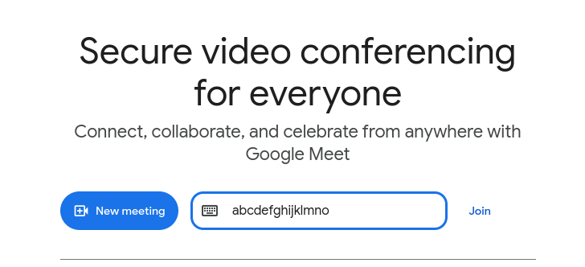
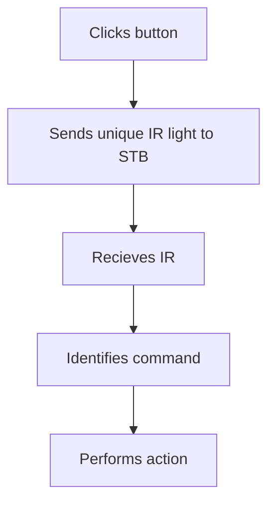

---
# You can also start simply with 'default'
theme: seriph
colorSchema: auto
# random image from a curated Unsplash collection by Anthony
# like them? see https://unsplash.com/collections/94734566/slidev
# background: https://cover.sli.dev
# some information about your slides (markdown enabled)
title: Introduction to APIs
download: false
info: false
author: Sheron Rajesh
# apply unocss classes to the current slide
# class: text-center
# https://sli.dev/features/drawing
drawings:
  persist: false
# slide transition: https://sli.dev/guide/animations.html#slide-transitions
transition: slide-left
# enable MDC Syntax: https://sli.dev/features/mdc
mdc: true
# open graph
seoMeta:
  # By default, Slidev will use ./og-image.png if it exists,
  # or generate one from the first slide if not found.
  ogImage: auto
  # ogImage: https://cover.sli.dev
---

# Introduction to APIs

---
layout: section
---

# What is API?

---
layout: fact
---

# Application Programming Interface

---
layout: quote
---

# Interface

## the boundary or point of interaction between two systems that allows them to communicate

---
layout: default
---

# Example: GUI (Graphical User Interface)

<v-click>

- Interfaces between the user and the internal functionalities
- Visual, graphical components
- Interactive components: **buttons**, **text inputs**, etc.
- Such interactive components lets the user "talk" to the internals

</v-click>

<br>

<v-click>

- User doesn't need to know what really happens when you click a button
- Interfaces hide a lot of complexities underneath

</v-click>

---
layout: image
---



---
layout: default
---

# So, API...

- Application Programming _**Interface**_
- Interfaces between one program and another
- Allows communication between two software components

<br>

<v-clicks>

- Systems that allows other systems to communicate with it through an interface:
  API **providers**
- The "application" in **Application Programming Interface** refers to such
  providers
- API **consumers**: utilizes the provider's interface
- Consumer doesn't have to know the internals of the provider

</v-clicks>

<br>

<v-click>

- Consumer only needs to know
  1. what kinds of stuff it can say to the provider
  2. what the provider will reply back for it.

</v-click>

---

# Example case: TV & remote

- Imagine a TV set top box; it has controls:
  - Power on / off,
  - Next / previous channels,
  - Volume up and down.
- Has the controls built-in on the set-top box, as buttons, outside

<br>

- TV remotes.
- Can't go and change any of the controls directly
- Uses IR light patterns to talk to the set-top box
- Has no idea what goes inside the TV

<!-- don't know what channel is it, or what the volume is or anything -->

---
layout: center
---



---

# Example case: TV & remote

- Universal remotes also just sends the IR in unique patterns
- The TV set-top box exposes an interface which anyone with IR can use

<br>

- TV is the API provider
- Remotes are the consumers

---

# Where APIs are used

- Almost everywhere where two components need to communicate.
- This includes any type of systems.

---
layout: two-cols
---

## Operating Systems

<br>

- POSIX (<logos-linux-tux /> Linux, <logos-freebsd /> BSD,&nbsp;
  <logos-apple style="fill: white" /> MacOS)
- Win32&nbsp; (<logos-microsoft-windows-icon/> Windows) APIs
- Provides APIs for
  - creating & killing processes,
  - open/read/write&ndash;ing files
  - etc.

::right::

<v-click>

## Libraries and Frameworks

<br>

- Libraries are used for their APIs
- Frameworks also provide helper APIs to be used while using that framework

</v-click>

---
layout: two-cols
---

## Programming Languages

<br>

- Comes with standard libraries and utilities for writing programs easily in
  that language:
  - Math,
  - data structures,
  - string formatting,
  - file system,
  - errors,
  - time & date,
  - processes.

::right::

<v-click>

## Web

<br>

- Browser APIs (client-side) which lets website use the functionalities given by
  the browser
- Web server APIs (services) provide APIs for building other applications
- HTTP, FTP APIs, REST, etc.

</v-click>

---
layout: two-cols-header
---

# HTTP

- HTTP is the communication protocol in Web
- **Client**: app that sends the request
- **Server**: app that recieves request, does something, returns the response
- Usually the client send the request for a web page, and the server returns it.
- Uses methods such as: `GET`, `POST`, `DELETE`, `OPTIONS`, etc.
- No specific architecture or style

<br>

::left::

`Request`

```http
GET /about HTTP/1.1
Host: example.com
```

::right::

`Response`

```http
HTTP/1.1 200 OK
Content-Type: text/html

<html> ... </html>
```

<style>
.two-cols-header {
  column-gap: 30px; /* Adjust the gap size as needed */
}
</style>

---
layout: two-cols-header
---

# HTTP API

When HTTP is not used for returning web pages (HTML), but for data exchange.

<br>

::left::

`Request`

```http
GET /users/12
Host: api.example.com
```

::right::

`Response`

```http
HTTP/1.1 200 OK
Content-Type: application/json

{
  "id": 12,
  "name": "Alex"
}
```

<style>
.two-cols-header {
  column-gap: 30px; /* Adjust the gap size as needed */
}
</style>

---

# Types of APIs

1. By access level:
   - Public (open)
   - Partner
   - Private (internal)

2. By Architecture / Protocol:
   - REST (Representational State Transfer)
   - SOAP (Simple Object Access Protocol)
   - GraphQL
   - RPC (Remote Procedure Call)
   - gRPC

---

# REST API

- REpresentational State Transfer
- Architectural style (not a standard)
- Designed by Roy Fielding
- Designed under the context of HTTP
- RESTful APIs are a subset of HTTP APIs that follows REST principles

---

# REST Principles

1. Client–Server Separation
2. Statelessness (server does not remember about previous interactions)
3. Cacheable
4. Uniform Interface (consistency, and standard-aligned)
5. Layered System (clients don't know if it's the server)
6. Code on Demand (optional)

---

# RESTful Resources

Everything is treated as a resource, usually in JSON format.

```
/users
/users/1
/users/1/posts
```

---

# HTTP Methods in REST APIs

| **Method** | **Description**      | **Example**  |
| ---------- | -------------------- | ------------ |
| `GET`      | Retrieve all data    | `/members`   |
| `GET`      | Retrieve single data | `/members/1` |
| `POST`     | Create data          | `/members`   |
| `PUT`      | Modify (replace)     | `/members/2` |
| `PATCH`    | Modify (partially)   | `/members/1` |
| `DELETE`   | Remove data          | `/members/1` |

---

# HTTP status codes

https://developer.mozilla.org/en-US/docs/Web/HTTP/Reference/Status

1. `100`-`199` Information
2. `200`-`299` Success
3. `300`-`399` Redirection
4. `400`-`499` Client error
5. `500`-`599` Server error

---

# Example APIs

https://github.com/public-apis/public-apis

---

# `cURL` & Postman

---
layout: center
class: text-center
---

# Thank you

<PoweredBySlidev mt-10 />
